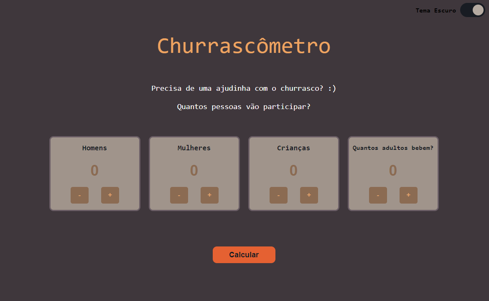
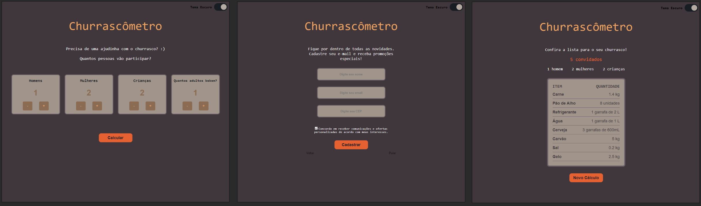

<h1> 🍖 Churrascômetro 🍖 </h1>

## 📄 Resumo do Projeto
Projeto final para o módulo de Front-End Dinâmico do curso Santander Coders 2023, com o tema de Churrascômetro. O projeto consistiu em desenvolver uma calculadora que indica a quantidade de itens para comprar para um churrasco de acordo com a quantidade de pessoas.

O projeto foi desenvolvido com os conceitos de manipulação dinâmica do DOM e em estilo Single Page Application (SPA).

Vamos fazer um churrasco? 👉 [Link para o Churrascômetro](https://livyuka.github.io/churrascometro-santander-coders/ "Churrascômetro")

## ✔️ Tecnologias utilizadas
- ``HTML``
- ``CSS``
- ``JavaScript``

## 🔨 Funcionalidades do projeto
- `Funcionalidade 1` `Input de convidados`: É possível inserir a quantidade de convidados tanto pelo botão quanto por teclado.
- `Funcionalidade 2` `Cálculo personalizado`: A calculadora gera a lista de acordo com o perfil dos convidados selecionados (homem / mulher / criança / pessoas que consomem bebida alcoólica).
- `Funcionalidade 3` `Tela de registro`: Uma tela irá pedir os dados do visitante para enviar e-mail marketing estratégicos de acordo com a localização, através do CEP fornecido.
- `Funcionalidade 4` `API de CEP`: Utilização de API para validar e coletar o dado de localização do visitante. Site utilizado para consulta: [ViaCEP](https://viacep.com.br "ViaCEP")

## 📑 Prévia do projeto

